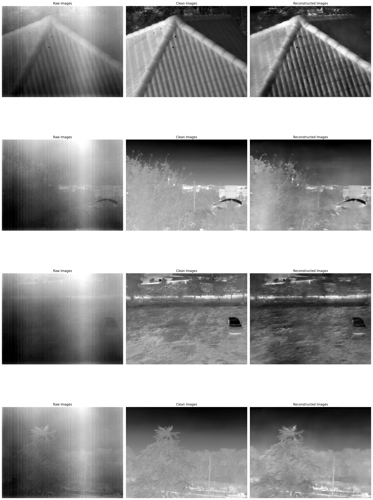

# Denoising in Thermal Images

A PyTorch implementation for removing fixed pattern noise (FPN) in thermal images using a U-Net architecture. This repository provides a modular codebase for training and evaluating deep learning models to restore clean thermal imagery from noisy inputs. Includes configurable training pipelines, data loaders, and metrics (PSNR/SSIM) for benchmarking. Ideal for researchers and engineers working on infrared imaging, industrial inspection, or computational photography.

## 🛠️ Installation and setup

To setup the codebase, please run the following commands:

```bash
# Clone the repository
git clone https://github.com/rishieraj/thermal-image-denoising.git

# Change to the root directory
cd thermal-denoising

# Install required packages
pip install -r requirements.txt
```

## 🚀 Pretrained models

Model weights can be downloaded from below. Checkpoints for more variation of models will be shared soon.

<table>
  <thead>
    <tr>
      <th>Model</th>
      <th>Base</th>
    </tr>
  </thead>
  <tbody>
    <tr>
      <td>UNet-Skip</td>
      <td><a href="https://drive.google.com/file/d/1CemHgRcZvU3ReJzBsJzsbz8swNzQyauf/view?usp=sharing">checkpoint</a></td>
    </tr>
  </tbody>
</table>

## 📥 Datasets

The dataset used to train the above model has been shared [here](https://drive.google.com/file/d/10uzL-NvWC4fELGCS7Wu0MOoCZHKYqvjV/view?usp=sharing). The dataset has to be added to the in `thermal-denoising/dataset/`. The dataset has the following splits:

<table>
  <thead>
    <tr>
      <th>Split</th>
      <th>Number of samples</th>
    </tr>
  </thead>
  <tbody>
    <tr>
      <td align="center">Train</td>
      <td align="center">1632</td>
    </tr>
    <tr>
      <td align="center">Val</td>
      <td align="center">205</td>
    </tr>
    <tr>
      <td align="center">Test</td>
      <td align="center">205</td>
    </tr>
    <tr>
      <td align="center"><b>Total</b></td>
      <td align="center"><b>2042</b></td>
    </tr>
  </tbody>
</table>

## 📉 Results

The denoised images for some sample cases have been shown below from the test dataset. The reconstruction accuracy achieved is **~87%**. Further improvements are in the works.

<div align="center">
  
</div>